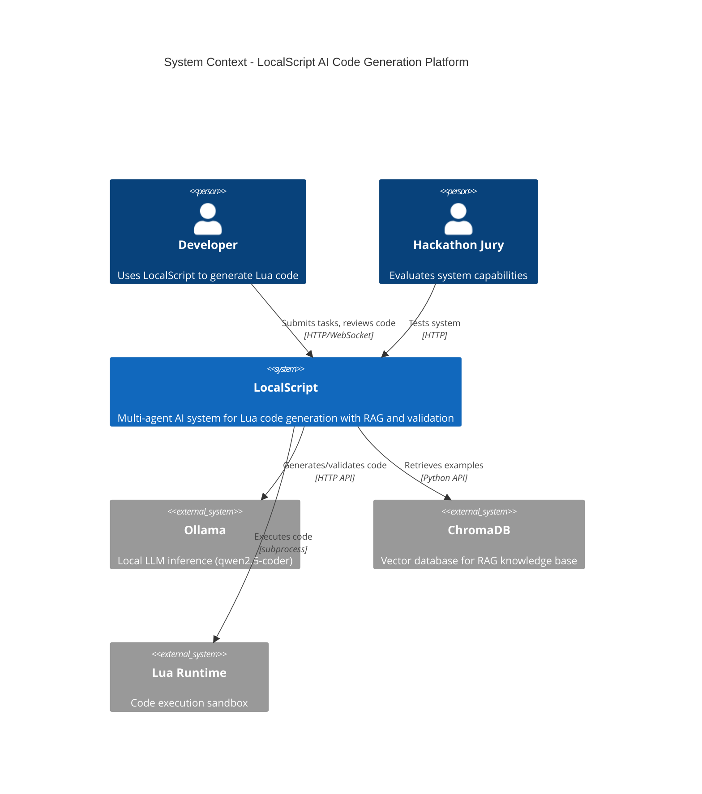

# LocalScript Architecture (C4 Model)

## System Context (Level 1)

## Key Characteristics

- **Multi-Agent Architecture**: 14 specialized AI agents orchestrated by LangGraph
- **Two Operational Modes**: Quick Mode (single file) and Project Mode (multi-file with evolution)
- **RAG-Enhanced**: Retrieval-Augmented Generation reduces hallucinations by 40%
- **Real Validation**: Actual Lua compilation and execution, not simulated
- **Optimized for Small Models**: Works efficiently with 7B parameter models (qwen2.5-coder:7b)

## Container Diagram

See [docs/c4-container.md](docs/c4-container.md) for detailed container architecture.

## Component Diagram

See [docs/c4-component.md](docs/c4-component.md) for internal component structure.

## Deployment

- **Docker Compose**: 2 containers (LocalScript + Ollama)
- **FastAPI Server**: REST API + WebSocket for real-time updates
- **Frontend**: Vanilla JS with D3.js for graph visualization
- **Storage**: File-based workspace + ChromaDB vector store

## Technology Stack

- **Backend**: Python 3.12, FastAPI, LangChain, LangGraph
- **LLM**: Ollama (qwen2.5-coder:7b-instruct-q4_K_M)
- **RAG**: ChromaDB + sentence-transformers (all-MiniLM-L6-v2)
- **Validation**: Lua 5.3+ with sandbox security
- **Frontend**: HTML5, D3.js, vanilla JavaScript
- **Infrastructure**: Docker, Docker Compose
