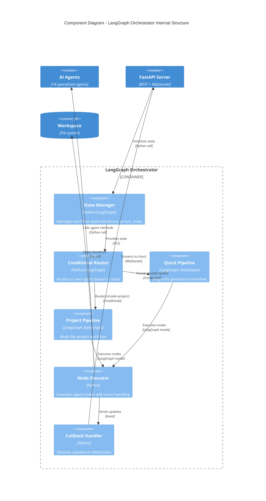

# Component Diagram (C4 Level 3)

## LangGraph Orchestrator Components



## Quick Mode Pipeline Components

### State Schema
```python
{
    "task": str,              # User's task description
    "code": str,              # Current code version
    "errors": str,            # Validation errors (if any)
    "review": str,            # Reviewer feedback (if any)
    "iterations": int,        # Current iteration count
    "max_iterations": int,    # Max retry limit (default: 10)
    "rag_context": str,       # Retrieved examples
    "test_code": str,         # Generated test cases
    "approved": bool,         # User approval status
    "clarified": bool,        # Task clarity status
}
```

### Node Components

#### 1. Clarifier Node
- **Input**: `task`
- **Output**: `clarified`, `questions` (if unclear)
- **Logic**: Analyzes task ambiguity, asks clarification questions
- **Agent**: ClarifierAgent

#### 2. RAG Retrieve Node
- **Input**: `task`
- **Output**: `rag_context`
- **Logic**: Semantic search in vector DB (top-k=3)
- **Agent**: RetrieverAgent

#### 3. RAG Approve Node
- **Input**: `task`, `rag_context`
- **Output**: `approved_template` or empty
- **Logic**: Evaluates relevance (threshold=0.6)
- **Agent**: ApproverAgent

#### 4. Generator Node
- **Input**: `task`, `errors`, `review`, `approved_template`
- **Output**: `code`
- **Logic**: Generates/fixes Lua code
- **Agent**: GeneratorAgent
- **Retry Logic**: Uses errors/review from previous iteration

#### 5. Test Generator Node
- **Input**: `task`, `code`
- **Output**: `test_code`
- **Logic**: Creates functional test cases (5-7 tests)
- **Agent**: TestGeneratorAgent

#### 6. Validator Node
- **Input**: `code`, `test_code`, `iterations`
- **Output**: `is_valid`, `errors`, `test_results`
- **Logic**: 
  - Compiles with `luac`
  - Executes in sandbox
  - Runs functional tests
  - Profiles (time, memory)
- **Agent**: ValidatorAgent

#### 7. Checkpoint Node
- **Input**: `code`, `test_results`
- **Output**: `approved`, `feedback`
- **Logic**: User approval gate (WebSocket interaction)
- **Agent**: CheckpointAgent

#### 8. Reviewer Node
- **Input**: `code`, `task`, `profile_metrics`
- **Output**: `review` or `<INFO> Finished`
- **Logic**: Quality check (correctness, completeness, performance)
- **Agent**: ReviewerAgent

### Conditional Edges

```python
# After Clarifier
if state["clarified"]:
    goto("rag_retrieve")
else:
    goto("clarify")  # Loop until clear

# After Validator
if state["is_valid"]:
    goto("checkpoint")
elif state["iterations"] >= state["max_iterations"]:
    goto("fail")
elif state["errors_count"] >= 2:
    goto("clarify_errors")  # Get clarification
else:
    goto("generate")  # Retry with errors

# After Checkpoint
if state["approved"]:
    goto("review")
elif state["alternatives_requested"]:
    goto("generate")  # Generate alternative
else:
    goto("generate")  # Apply feedback

# After Reviewer
if "<INFO> Finished" in state["review"]:
    goto("end")
else:
    goto("generate")  # Apply improvements
```

## Project Mode Pipeline Components

### Additional Nodes

#### 9. Architect Node
- **Input**: `task`
- **Output**: `project_plan` (JSON)
- **Logic**: Plans file structure, dependencies, build order
- **Agent**: ArchitectAgent

#### 10. Specification Node
- **Input**: `project_plan`, `current_file`
- **Output**: `file_spec` (JSON)
- **Logic**: Creates detailed spec for each file
- **Agent**: SpecificationAgent

#### 11. Integrator Node
- **Input**: `all_files`
- **Output**: `integration_result`
- **Logic**: Tests module integration with main.lua
- **Agent**: IntegratorAgent

#### 12. Decomposer Node
- **Input**: `code`
- **Output**: `analysis` (functions, complexity, dependencies)
- **Logic**: Analyzes code structure
- **Agent**: DecomposerAgent

#### 13. Evolver Node
- **Input**: `code`, `analysis`
- **Output**: `should_evolve`, `improvements`
- **Logic**: Suggests optimizations (runs 3 evolution cycles)
- **Agent**: EvolverAgent

### Project Mode Flow
```
START → Architect → Specification → [For each file]:
                                      Generator → Validator → Reviewer
                                    → Integrator → [Decomposer, Evolver] → END
```

## Error Handling Components

### Retry Strategy
```python
class RetryHandler:
    def should_retry(state):
        return (
            not state["is_valid"] and 
            state["iterations"] < state["max_iterations"]
        )
    
    def get_retry_context(state):
        return {
            "errors": state["errors"],
            "previous_code": state["code"],
            "iteration": state["iterations"]
        }
```

### Error Clarification
- **Trigger**: 2+ consecutive validation errors
- **Action**: Clarifier analyzes errors, asks targeted questions
- **Benefit**: Breaks error loops by getting user input

## Performance Optimizations

### Caching Components
1. **RAG Cache**: Stores retrieval results (100 entries, LRU)
2. **LLM Response Cache**: Caches identical prompts (disabled by default)
3. **Compilation Cache**: Reuses `luac` results for unchanged code

### Parallel Execution
- **Current**: Sequential (LangGraph synchronous)
- **Future**: Parallel agent calls for independent tasks (e.g., Test Generator + Decomposer)

### Streaming
- **WebSocket**: Real-time updates (node transitions, code chunks)
- **SSE Alternative**: Server-Sent Events for one-way streaming

## Monitoring Components

### Metrics Collector
```python
{
    "session_id": str,
    "mode": "quick" | "project",
    "total_time": float,
    "iterations": int,
    "agents_called": List[str],
    "llm_calls": int,
    "tokens_used": int,
    "success": bool,
    "error_type": str | None
}
```

### Logging
- **Level**: INFO (production), DEBUG (development)
- **Format**: Structured JSON logs
- **Destinations**: stdout, file (`logs/localscript.log`)

## Testing Components

### Unit Tests
- `tests/test_agents.py` - Individual agent logic
- `tests/test_pipeline.py` - Workflow state transitions
- `tests/test_lua_runner.py` - Sandbox security

### Integration Tests
- `tests/test_rag_workflow_integration.py` - End-to-end RAG flow
- `tests/test_docker_sandbox.py` - Docker execution

### Performance Tests
- `test_public_tasks.py` - Real-world task benchmarks
- `test_lowcode_tasks.py` - LowCode-specific scenarios

## Configuration Components

### Settings Loader
- **Source**: `config/settings.yaml` + environment variables
- **Priority**: ENV vars > YAML > defaults
- **Hot Reload**: Not supported (requires restart)

### Agent Prompts
- **Source**: `config/agents.yaml`
- **Format**: YAML with role + system_prompt
- **Customization**: Per-agent LLM backend/model overrides

## Deployment Components

### Docker Compose
```yaml
services:
  localscript:
    - FastAPI server (port 8000)
    - LangGraph orchestrator
    - All agents
  
  ollama:
    - LLM inference (port 11434)
    - Model: qwen2.5-coder:7b-instruct-q4_K_M
```

### Health Checks
- **API**: `GET /health` → 200 OK
- **Ollama**: `curl localhost:11434/api/tags`
- **ChromaDB**: Embedded (no separate health check)

## Future Enhancements

1. **Agent Parallelization**: Run independent agents concurrently
2. **Distributed LLM**: Support multiple Ollama instances
3. **Persistent Sessions**: Resume interrupted workflows
4. **Multi-User**: Workspace isolation, user authentication
5. **Cloud LLM Fallback**: Use OpenRouter/Anthropic for complex tasks
