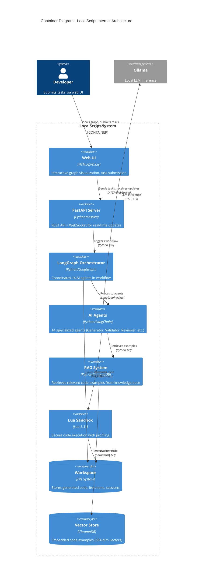

# Container Diagram (C4 Level 2)

## LocalScript System Containers



## Container Responsibilities

### Web UI
- **Technology**: Vanilla JavaScript, D3.js
- **Purpose**: Interactive visualization of agent workflow
- **Features**:
  - Real-time graph updates via WebSocket
  - Mode selection (Quick/Project)
  - Code display with syntax highlighting
  - Execution metrics (time, memory)

### FastAPI Server
- **Technology**: Python 3.12, FastAPI, Uvicorn
- **Purpose**: HTTP API + WebSocket gateway
- **Endpoints**:
  - `POST /run` - Submit task
  - `GET /sessions` - List sessions
  - `WS /ws` - Real-time updates
  - `GET /health` - Health check

### LangGraph Orchestrator
- **Technology**: LangGraph (LangChain)
- **Purpose**: State machine for agent coordination
- **Modes**:
  - **Quick Mode**: Linear pipeline (8 agents)
  - **Project Mode**: Multi-file with evolution (11 agents)
- **State Management**: Tracks iterations, errors, code versions

### AI Agents (14 total)
1. **Clarifier** - Analyzes task ambiguity
2. **Retriever** - Searches RAG knowledge base
3. **Approver** - Evaluates RAG relevance
4. **Generator** - Writes Lua code
5. **Validator** - Compiles and executes code
6. **Test Generator** - Creates functional tests
7. **Reviewer** - Quality check
8. **Checkpoint** - User approval gate
9. **Architect** - Plans project structure (Project Mode)
10. **Specification** - Creates detailed specs (Project Mode)
11. **Integrator** - Tests module integration (Project Mode)
12. **Decomposer** - Analyzes code structure (Project Mode)
13. **Evolver** - Optimizes and refines (Project Mode)
14. **Error Clarifier** - Clarifies after validation errors

### RAG System
- **Technology**: ChromaDB, sentence-transformers
- **Purpose**: Reduce hallucinations via example retrieval
- **Features**:
  - 384-dim embeddings (all-MiniLM-L6-v2)
  - Semantic search (top-k=3)
  - Approval threshold (0.6)
  - Result caching (100 entries)

### Lua Sandbox
- **Technology**: Lua 5.3+ with security restrictions
- **Purpose**: Safe code execution
- **Security**:
  - Blocks: `io.open`, `os.execute`, `require`, `loadfile`
  - Allows: `io.write`, `os.clock`, standard libraries
  - Profiling: execution time, memory usage

### Workspace
- **Technology**: File system
- **Structure**:
  ```
  workspace/
    session_YYYYMMDD_HHMMSS/
      task.txt
      iteration_1.lua
      iteration_2.lua
      final.lua
      report.md
  ```

### Vector Store
- **Technology**: ChromaDB (persistent)
- **Location**: `.veai/chroma/`
- **Content**: Lua code examples with metadata
- **Size**: ~100 examples (expandable)

## Communication Patterns

### Synchronous Flow (Quick Mode)
```
User → Web UI → API → Orchestrator → Agents → Ollama
                                    ↓
                                  Sandbox → Workspace
```

### Asynchronous Updates
```
Orchestrator → WebSocket → Web UI (real-time graph updates)
```

### RAG Flow
```
Generator → Retriever → Vector DB → Approver → Generator (with examples)
```

## Scalability Considerations

- **Stateless API**: Can run multiple FastAPI instances
- **LLM Bottleneck**: Ollama is single-threaded (sequential agent calls)
- **Workspace**: File-based, suitable for single-user or small teams
- **Vector DB**: ChromaDB supports millions of vectors (current: ~100)

## Security

- **Sandbox**: Lua code runs in restricted environment
- **No External Access**: Blocked network, file I/O, shell commands
- **Input Validation**: FastAPI Pydantic models
- **CORS**: Configurable for production deployment
